# 🚀 Multi-Node Distributed CockroachDB Cluster with HAProxy

Bu proje; yüksek erişilebilirlik (High Availability), veri yerelliği (Locality) ve tam güvenlik (mTLS) prensiplerine dayalı, **5 node'lu dağıtık bir CockroachDB** kümesinin kurulum ve optimizasyon sürecini kapsar.

## 🏗️ Mimari ve Ağ Tasarımı

```mermaid
graph LR
    %% External World - Light Grey
    subgraph Clients [<b>DIŞ DÜNYA</b>]
        User([Geliştirici])
        DBeaver[(DBeaver)]
        PHP[PHP App]
    end

    %% Load Balancer - Vibrant Orange
    subgraph LB [<b>LOAD BALANCER</b>]
        HAProxy[HAProxy Server<br/>192.168.1.50]
    end

    %% Cluster Nodes - Distinct Blues
    subgraph Cluster [<b>COCKROACHDB CLUSTER</b>]
        subgraph R1 [Rack 1]
            N1[Node 1]
            N2[Node 2]
        end
        subgraph R2 [Rack 2]
            N3[Node 3]
            N4[Node 4]
            N5[Node 5]
        end
    end

    %% Connections with Colors
    %% SQL Traffic (Green)
    Clients -- "<font color='green'>SQL Port 26257</font>" --> HAProxy
    HAProxy -- "<font color='green'>LB -> SQL 26258</font>" --> N1 & N2 & N3 & N4 & N5

    %% Internal Sync (Red - Stronger weight)
    N1 <== "<font color='red'>Sync 26257 (NIC 2)</font>" ==> N2
    N2 <== "<font color='red'>P2P Sync</font>" ==> N3
    N3 <== "<font color='red'>P2P Sync</font>" ==> N4
    N4 <== "<font color='red'>P2P Sync</font>" ==> N5

    %% Health Checks (Purple - Dashed)
    HAProxy -. "<font color='purple'>Health 8080</font>" .-> N1
    HAProxy -. "Check" .-> N3

    %% Styling
    style Clients fill:#f5f5f5,stroke:#d4d4d4,color:#333
    style LB fill:#fff4e6,stroke:#fd7e14,stroke-width:2px,color:#d9480f
    style HAProxy fill:#ffe8cc,stroke:#fd7e14
    
    style Cluster fill:#f0f7ff,stroke:#0052cc,color:#0052cc
    style R1 fill:#e7f5ff,stroke:#228be6,stroke-dasharray: 5 5
    style R2 fill:#e7f5ff,stroke:#228be6,stroke-dasharray: 5 5
    
    style N1 fill:#339af0,stroke:#1864ab,color:#fff
    style N2 fill:#339af0,stroke:#1864ab,color:#fff
    style N3 fill:#4dadf7,stroke:#1971c2,color:#fff
    style N4 fill:#4dadf7,stroke:#1971c2,color:#fff
    style N5 fill:#4dadf7,stroke:#1971c2,color:#fff

    %% Link Colors
    linkStyle 0,1,2,3,4,5 stroke:green,stroke-width:2px
    linkStyle 6,7,8,9 stroke:red,stroke-width:3px
    linkStyle 10,11 stroke:purple,stroke-width:1px
```



Sistem performansı ve güvenliği için her sunucuda **3 fiziksel/sanal ağ kartı (NIC)** kullanılmıştır:
1. **Management Network:** SSH ve sistem güncellemeleri için.
2. **Internal Data Network (Sync):** Node'ların kendi aralarındaki P2P veri senkronizasyonu için.
3. **Public/SQL Network:** HAProxy ve istemci (Client) bağlantıları için.

### 📍 Dağıtık Yapı ve Üç Katmanlı Ağ Mimarisi (Triple-NIC)
Küme, ağ trafiğini izole etmek ve hata toleransını artırmak için üç farklı ağ katmanı üzerinden iki ayrı rack üzerine dağıtılmıştır:

| Sunucu | Rol | Public/NAT IP (Management) | Internal Sync IP (P2P/Gossip) | SQL/HAProxy IP (Client) | Bölge (Locality) |
| :--- | :--- | :--- | :--- | :--- | :--- |
| **HAProxy** | Load Balancer | `192.168.1.50` | `10.0.1.100` | `172.16.1.50` | Frontend |
| **Node 1** | DB Node | `192.168.1.11` | `10.0.1.11` | `172.16.1.11` | region=tr,zone=rack1 |
| **Node 2** | DB Node | `192.168.1.12` | `10.0.1.12` | `172.16.1.12` | region=tr,zone=rack1 |
| **Node 3** | DB Node | `192.168.1.13` | `10.0.2.13` | `172.16.1.13` | region=tr,zone=rack2 |
| **Node 4** | DB Node | `192.168.1.14` | `10.0.2.14` | `172.16.1.14` | region=tr,zone=rack2 |
| **Node 5** | DB Node | `192.168.1.15` | `10.0.2.15` | `172.16.1.15` | region=tr,zone=rack2 |

---

### 🔌 Port Görev Dağılımı ve Trafik İzolasyonu
Güvenlik ve performans için **Port Separation (Port Ayrımı)** stratejisi uygulanmıştır:

| Port | Servis | Açıklama |
| :--- | :--- | :--- |
| **26257 (Dış)** | **HAProxy Entry** | **İstemci Girişi:** Windows, PHP veya DBeaver bu port üzerinden HAProxy'ye bağlanır. |
| **26257 (İç)** | **Internal Node** | **Sync Portu:** Sadece node'ların kendi aralarındaki (Gossip/Raft) iletişimi için ayrılmıştır. |
| **26258** | **SQL Engine** | **SQL Portu:** HAProxy, dışarıdan gelen talepleri node'ların bu özel SQL kapısına iletir. |
| **8080** | **HTTP / Health** | **İzleme:** Dashboard ve HAProxy sağlık kontrolleri bu porttan yapılır. |

---

## 🛠️ 1. Kurulum ve Hazırlık

### 1.1. Binary ve Kütüphanelerin Yüklenmesi

Tüm node'larda CockroachDB v23.1.0 kurulumu ve mekansal (spatial) veri desteği için GEOS kütüphanelerinin yapılandırılması:

```bash
wget https://binaries.cockroachdb.com/cockroach-v23.1.0.linux-amd64.tgz
tar -xvf cockroach-v23.1.0.linux-amd64.tgz
sudo cp cockroach-v23.1.0.linux-amd64/cockroach /usr/local/bin/
sudo cp -r cockroach-v23.1.0.linux-amd64/lib/* /usr/local/lib/
sudo ldconfig
```

---

## 🔐 2. Güvenlik: TLS/SSL Sertifikasyon süreci

Cluster "Secure Mode" protokolünde çalışmaktadır. Sertifikalar oluşturulurken HAProxy IP'si SAN (Subject Alternative Name) olarak eklenmiştir.

### 2.1. CA ve Node Sertifikaları
```bash
# CA Oluşturma (Sadece Ana Node)
cockroach cert create-ca --certs-dir=certs --ca-key=my-safe-directory/ca.key

# Node Sertifikaları (HAProxy IP'sini ve Tüm Node IP'lerini kapsar)
cockroach cert create-node 10.0.1.11 10.0.1.12 10.0.2.13 10.0.2.14 10.0.2.15 10.0.1.50 localhost 127.0.0.1 --certs-dir=certs --ca-key=my-safe-directory/ca.key
```

---

## ⚙️ 3. Cluster Başlatma (Port Separation)

Bu mimaride **Internal (26257)** ve **External SQL (26258)** portları birbirinden ayrılmıştır. 

### 3.1. Node Başlatma Komutu (Örnek: Node 1)
```bash
cockroach start \
  --certs-dir=certs \
  --store=path/to/data \
  --listen-addr=10.0.1.11:26257 \
  --sql-addr=10.0.1.11:26258 \
  --http-addr=10.0.1.11:8080 \
  --locality=region=tr,zone=rack1 \
  --join=10.0.1.11:26257,10.0.1.12:26257,10.0.2.13:26257... \
  --background
```

### 3.2. Cluster'ı Initialize Etme
```bash
cockroach init --certs-dir=certs --host=10.0.1.11:26257
```

### 3.3. Web Panel Erişimi ve Kullanıcı Yetkilendirme

Güvenli modda (Secure Mode) başlatılan bir cluster'da Web Dashboard'a erişmek için veritabanı üzerinde bir kullanıcı oluşturmalı ve bu kullanıcıya parola atamalısınız.

#### 1. SQL Shell üzerinden kullanıcı oluşturma:
Önce kümenize bağlanın ve bir yönetim kullanıcısı oluşturun:
```sql
-- Kullanıcıyı oluşturun
CREATE USER admin_user WITH PASSWORD 'güçlü_bir_parola';

-- Kullanıcıya admin yetkisi verin (Dashboard'daki tüm verileri görmesi için)
GRANT admin TO admin_user;
```

#### 2. Panele Giriş:
1. Tarayıcınızdan `https://<HAPROXY-IP-ADRESI>:8080` adresine gidin.
   * *Not:* Güvenli modda panel `https` protokolü üzerinden çalışır. Sertifika uyarısı alırsanız "Gelişmiş -> Devam Et" diyerek geçebilirsiniz.
2. Açılan ekranda oluşturduğunuz **Username** (`admin_user`) ve **Password** bilgilerini girerek giriş yapın.

#### 3. Sertifika ile Otomatik Login (Alternatif):
Eğer tarayıcınıza `client.root.crt` sertifikasını bir P12 dosyasına dönüştürüp yüklerseniz, panel sizi sertifikanızdan tanıyabilir. Ancak en pratik ve yaygın yöntem yukarıdaki **User/Password** yöntemidir.

---


---

## ⚖️ 4. HAProxy Yapılandırması

HAProxy, dışarıdan gelen SQL taleplerini (26257) alır ve node'ların özel SQL portlarına (26258) `roundrobin` algoritmasıyla dağıtır.

### `/etc/haproxy/haproxy.cfg`
```haproxy
global
    log 127.0.0.1 local0
    maxconn 4096

defaults
    log global
    mode tcp
    option tcplog

listen psql
    bind 10.0.1.50:26257
    mode tcp
    balance roundrobin
    option httpchk GET /health?ready=1
    server node1 10.0.1.11:26258 check port 8080
    server node2 10.0.1.12:26258 check port 8080
    server node3 10.0.2.13:26258 check port 8080
    server node4 10.0.2.14:26258 check port 8080
    server node5 10.0.2.15:26258 check port 8080
```

---

## 🔌 5. Bağlantı Rehberi

### 🐚 Linux CLI (Alias)
```bash
alias crdb='cockroach sql --url "postgresql://root@10.0.1.50:26257/defaultdb?sslmode=verify-ca&sslrootcert=certs/ca.crt&sslcert=certs/client.root.crt&sslkey=certs/client.root.key"'
```

### 🪟 Windows (PowerShell)
```powershell
.\cockroach.exe sql --url "postgresql://root@10.0.1.50:26257/defaultdb?sslmode=verify-ca&sslrootcert=certs\ca.crt&sslcert=certs\client.root.crt&sslkey=certs\client.root.key"
```

### 🐘 PHP PDO Bağlantısı
```php
$dsn = "pgsql:host=10.0.1.50;port=26257;dbname=defaultdb;sslmode=verify-ca;sslrootcert=C:/certs/ca.crt;sslcert=C:/certs/client.root.crt;sslkey=C:/certs/client.root.key";
$pdo = new PDO($dsn, 'root');
```

---

## 🛡️ Hata Giderme (Troubleshooting)
- **Node Bağlantı Sorunu:** Sertifikaların SAN (IP) listesini kontrol edin.
- **HAProxy Logları:** `tail -f /var/log/haproxy.log` komutu ile trafiği izleyin.
- **Port Erişimi:** 26257 (Internal) ve 26258 (SQL) portlarının firewall tarafından izinli olduğundan emin olun.


